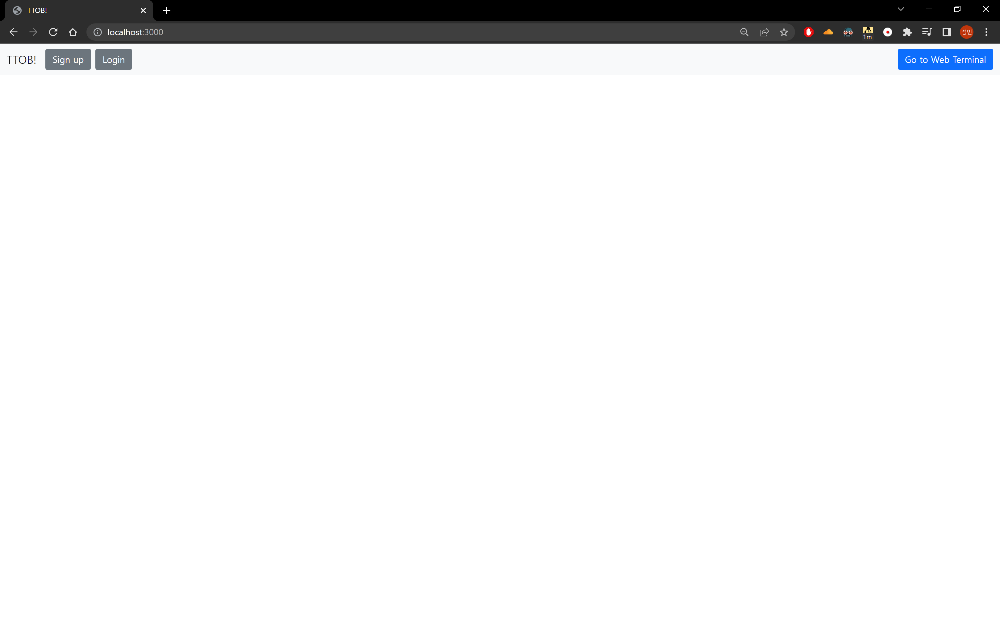
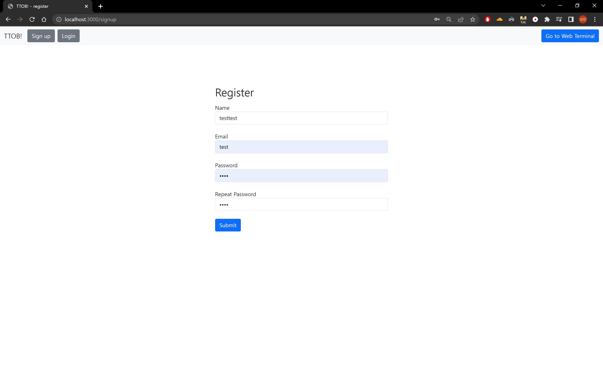
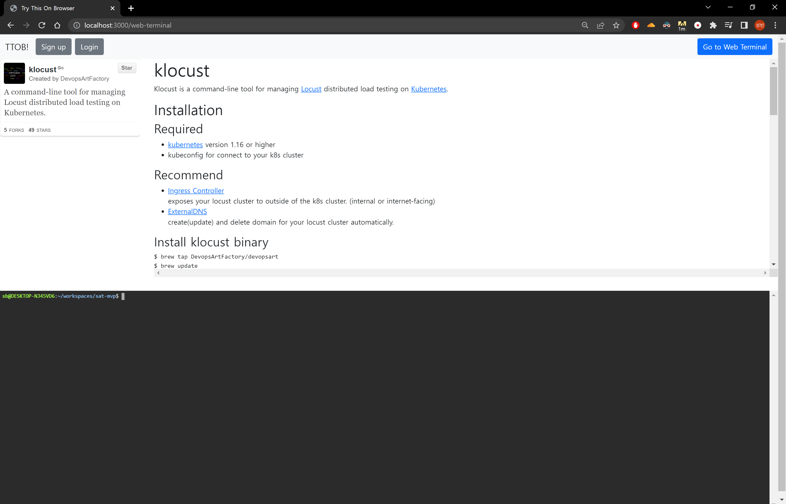

# TTOB!

Try This On Browser MVP

### [DEMO](http://18.235.194.72/)

Web Terminal 방문시 1234:1234 입력해 셸에 로그인한다.

### 설정
> `.env` 파일에서 `MYSQL_ROOT_PASSWORD` 을 설정한다. 이 값은 NodeJs와 MySQL 컨테이너 모두에서 공유된다.

### docker-compose를 활용한 실행/배포

> Docker 및 docker-compose 설치가 필요하다.
>
> `.env` 파일에서 `TTYD_HOST`, `MYSQL_HOST`를 설정한다.
>
> 로컬호스트에서 구동하는 경우 `TTYD_HOST=localhost`로 설정한다.
>
> compose로 실행하는 경우 `MYSQL_HOST=mysql`이고, 수동 실행 시에는 `localhost`로 놓는다.

```bash
$ git clone https://github.com/trythisonbrowser/sat-mvp

$ sudo docker-compose up -d
```

### Linux 상에서 Docker/compose 설치 방법

아래의 스크립트 작성 후 실행 시 Docker, compose가 설치된다.

생성: install.sh
```bash
#!/bin/bash
curl -fsSL https://get.docker.com -o get-docker.sh
sudo sh get-docker.sh

sudo curl -L "https://github.com/docker/compose/releases/download/1.29.2/docker-compose-$(uname -s)-$(uname -m)" -o /usr/local/bin/docker-compose

sudo chmod +x /usr/local/bin/docker-compose
```

실행
```bash
$ chmod +x install.sh
$ sudo ./install.sh
```

### 화면/기능 소개

#### Page: Home


#### Page: Register


#### Page: Sign in


#### Page: Web Terminal

Alpine 이미지 기반으로 ttyd가 실행되고 있기 때문에 실제로 실행해볼만한 binary가 거의 없다. (top 정도)

